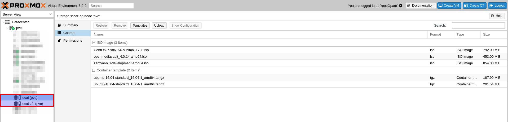
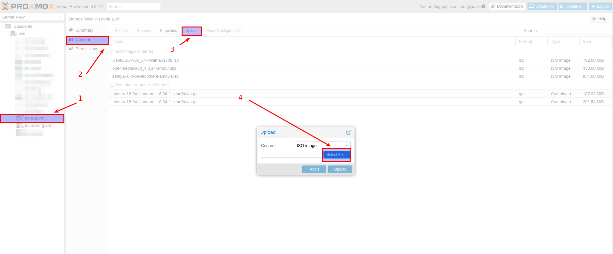
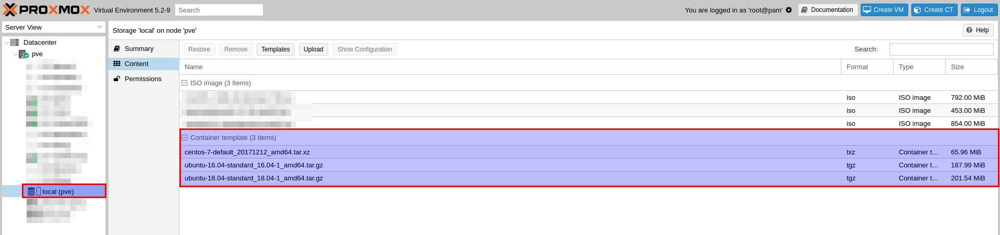

# Sommaire

<!-- TOC depthFrom:1 depthTo:6 withLinks:1 updateOnSave:1 orderedList:0 -->

- [Sommaire](#sommaire)
	- [Découverte](#dcouverte)
	- [Caractéristiques de Proxmox VE](#caractristiques-de-proxmox-ve)
	- [Lab.](#lab)
		- [Hardware](#hardware)
		- [Installlation](#installlation)
		- [Configurations](#configurations)
			- [Network configurations](#network-configurations)
			- [DNS](#dns)
			- [Storage](#storage)
				- [Envoyer une images ISO sur Proxmox](#envoyer-une-images-iso-sur-proxmox)
				- [Télécharger des 'Template Containers'](#tlcharger-des-template-containers)
					- [Connectez-vous sur votre noeud Proxmox via SSH](#connectez-vous-sur-votre-noeud-proxmox-via-ssh)
					- [Lister les 'Template' Container disponibles](#lister-les-template-container-disponibles)

<!-- /TOC -->

## Découverte

 Proxmox Virtual Environment est une solution de virtualisation libre (licence AGPLv3) basée sur l'hyperviseur Linux KVM, et offre aussi une solution de containers avec LXC.

 Elle propose un support payant.

 Proxmox est une solution de virtualisation de type "bare metal".

 Le packaging de Proxmox VE est fourni sur une image iso.

 L'installateur (basé sur Debian) configure tout ceci :

 - Système d'exploitation complet (Debian Stable 64 bits)
 - Partitionnement de disque dur avec LVM2 et ZFS
 - Support de LXC (containers) et du module KVM (virtualisation complète)
 - Outils de sauvegarde et de restauration
 - Interface web d'administration et de supervision.
 - Fonctions de clustering qui permet par exemple la migration à chaud des machines virtuelles d'un serveur physique à un autre (à condition d'utiliser un stockage partagé, SAN, ou Ceph sinon la migration entraîne une courte interruption lors du redémarrage sur un autre nœud du cluster).

## Caractéristiques de Proxmox VE

Propose 2 types de virtualisation :
- Virtualisation matérielle (ou complète) : [KVM](https://fr.wikipedia.org/wiki/Kernel-based_Virtual_Machine) : permet la virtualisation de tout système d'exploitation sur des processeurs d'architectures x86_64 disposant des technologies Intel VT ou AMD-V.

- Virtualisation par container : [LXC](https://fr.wikipedia.org/wiki/LXC) : permet la création d'instances de système d'exploitation isolées, Linux uniquement, appelées Serveurs Privés Virtuels (VPS), environnements virtuels (VE) ou Containers. Cette solution est plus performante (consomme moins de ressources) qu'une virtualisation matérielle du fait du peu d'overhead.


## Lab.

Proxmox permet de se monter un Labo à domicile à moindre frais !


Pour exemple :
- Hostname : pve
- CPU : 8 x Intel(R) Core(TM) i7-3770 CPU @ 3.40GHz (1 Socket)
- RAM : 16 GB DDR3
- DISK : 3x1TB 3.5" SATA
- Partition type : ZFS (RAID0)

> A adapter selon votre FAI

- IP : 192.168.1.250
- Subnet Mask : 255.255.255.0
- Gateway : 192.168.1.254
- DNS : 8.8.8.8, 8.8.4.4


### Hardware

- CPU : x86_64 disposant des technologies Intel VT ou AMD-V
- RAM : 8GB (ou +)
- Disk : 500 GB (RAID0 - pour de meilleurs performances)
- LAN : Une carte Ethernet Gigabit (ou +)

### Installlation

Récuperez le media d'installation et le guide :

- [Proxmox VE ISO Installer](https://www.proxmox.com/en/downloads/)
- [Proxmox VE Admin Guide ](https://www.proxmox.com/en/downloads/item/proxmox-ve-admin-guide-for-5-x)

### Configurations

Par défaut URL de l'interface de configurations : https://192.168.1.250:8006/

- Username : root
- Password : <définit lors de l'installation de Proxmox>

#### Network configurations

A l'aide de l'interface web :

Sélectionnez :
- Noeud (PVE)
	- Network


L'assistant d'installation à crée automatiquement :

- Names : vmbr0
- Type : Linux Bridge
- Ports : enp2s0
- IP : 192.168.x.250
- Subnet mask : 255.255.255.0
- Gateway : 192.168.x.x
- Comment : LAN1

> A noter qu'un bridge peux agréger plusieurs cartes ethernet

#### DNS

A l'aide de l'interface web :

Selectionnez :
- Noeud (PVE)
	- Network
		- DNS

> Pour le moment nous utiliserons les DNS de Google, cette configuration évoluera lors que nous deployerons notre DNS local.

- DNS Server 1 : 8.8.8.8
- DNS Server 2 : 8.8.4.4


#### Storage

> Vous observerez sur votre Noeud (par defaut) la présence de deux 'Storage' :
- local (pve) - Dédié au stockage des Images ISO de nos OS et 'Template' Container (Communauté)
- local-zfs (pve) - Dédié aux 'Disk images' de nos VMs et 'Containers'



> Pour nos futures VMs et Containers nous aurons besoin de télécharger les Images ISO des OS suivants, disponible ici :
- [CentOS 7 (Minimal)](http://isoredirect.centos.org/centos/7/isos/x86_64/CentOS-7-x86_64-Minimal-1804.iso)
- [Ubuntu 16.04 LTS (Network)](https://www.ubuntu.com/download/alternative-downloads#network-installer)
- [Ubuntu 18.04 LTS (Network)](https://www.ubuntu.com/download/alternative-downloads#network-installer)

##### Envoyer une images ISO sur Proxmox



##### Télécharger des 'Template Containers'

######  Connectez-vous sur votre noeud Proxmox via SSH

- Windows, via [PuTTY](https://www.putty.org/):
- Linux, depuis un terminal :

```bash
ssh root@192.168.1.250
```

###### Lister les 'Template' Container disponibles

```bash
pveam available
```

```bash
system          alpine-3.6-default_20180913_amd64.tar.xz
system          alpine-3.7-default_20180913_amd64.tar.xz
system          alpine-3.8-default_20180913_amd64.tar.xz
system          archlinux-base_20180906-1_amd64.tar.gz
system          centos-6-default_20161207_amd64.tar.xz
system          centos-7-default_20171212_amd64.tar.xz
system          debian-6.0-standard_6.0-7_amd64.tar.gz
system          debian-7.0-standard_7.11-1_amd64.tar.gz
system          debian-8.0-standard_8.7-1_amd64.tar.gz
system          debian-9.0-standard_9.5-1_amd64.tar.gz
system          fedora-27-default_20171212_amd64.tar.xz
system          fedora-28-default_20180907_amd64.tar.xz
system          gentoo-current-default_20180906_amd64.tar.xz
system          opensuse-15.0-default_20180907_amd64.tar.xz
system          opensuse-42.3-default_20171214_amd64.tar.xz
system          ubuntu-12.04-standard_12.04-1_amd64.tar.gz
system          ubuntu-14.04-standard_14.04-1_amd64.tar.gz
system          ubuntu-16.04-standard_16.04-1_amd64.tar.gz
system          ubuntu-16.10-standard_16.10-1_amd64.tar.gz
system          ubuntu-17.04-standard_17.04-1_amd64.tar.gz
system          ubuntu-17.10-standard_17.10-1_amd64.tar.gz
system          ubuntu-18.04-standard_18.04-1_amd64.tar.gz
system          ubuntu-18.10-standard_18.10-1_amd64.tar.gz
turnkeylinux    debian-9-turnkey-ansible_15.0-1_amd64.tar.gz
turnkeylinux    debian-9-turnkey-asp-net-apache_15.0-1_amd64.tar.gz
turnkeylinux    debian-9-turnkey-b2evolution_15.1-1_amd64.tar.gz
turnkeylinux    debian-9-turnkey-bugzilla_15.0-1_amd64.tar.gz
turnkeylinux    debian-9-turnkey-cakephp_15.0-1_amd64.tar.gz
turnkeylinux    debian-9-turnkey-canvas_15.0-1_amd64.tar.gz
turnkeylinux    debian-9-turnkey-codeigniter_15.0-1_amd64.tar.gz
turnkeylinux    debian-9-turnkey-collabtive_15.1-1_amd64.tar.gz
turnkeylinux    debian-9-turnkey-concrete5_15.0-1_amd64.tar.gz
turnkeylinux    debian-9-turnkey-core_15.0-1_amd64.tar.gz
turnkeylinux    debian-9-turnkey-couchdb_15.0-1_amd64.tar.gz
turnkeylinux    debian-9-turnkey-django_15.0-1_amd64.tar.gz
turnkeylinux    debian-9-turnkey-dokuwiki_15.0-1_amd64.tar.gz
turnkeylinux    debian-9-turnkey-domain-controller_15.0-1_amd64.tar.gz
turnkeylinux    debian-9-turnkey-drupal7_15.1-1_amd64.tar.gz
turnkeylinux    debian-9-turnkey-drupal8_15.2-1_amd64.tar.gz
turnkeylinux    debian-9-turnkey-e107_15.0-1_amd64.tar.gz
turnkeylinux    debian-9-turnkey-elgg_15.0-1_amd64.tar.gz
turnkeylinux    debian-9-turnkey-espocrm_15.1-1_amd64.tar.gz
turnkeylinux    debian-9-turnkey-ezplatform_15.0-1_amd64.tar.gz
turnkeylinux    debian-9-turnkey-fileserver_15.0-1_amd64.tar.gz
turnkeylinux    debian-9-turnkey-foswiki_15.0-1_amd64.tar.gz
turnkeylinux    debian-9-turnkey-gallery_15.0-1_amd64.tar.gz
turnkeylinux    debian-9-turnkey-ghost_15.1-1_amd64.tar.gz
turnkeylinux    debian-9-turnkey-gitea_15.0-1_amd64.tar.gz
turnkeylinux    debian-9-turnkey-gitlab_15.0-1_amd64.tar.gz
turnkeylinux    debian-9-turnkey-gnusocial_15.0-1_amd64.tar.gz
turnkeylinux    debian-9-turnkey-icescrum_15.0-1_amd64.tar.gz
turnkeylinux    debian-9-turnkey-jenkins_15.2-1_amd64.tar.gz
turnkeylinux    debian-9-turnkey-joomla3_15.1-1_amd64.tar.gz
turnkeylinux    debian-9-turnkey-lamp_15.0-1_amd64.tar.gz
turnkeylinux    debian-9-turnkey-lapp_15.0-1_amd64.tar.gz
turnkeylinux    debian-9-turnkey-laravel_15.0-1_amd64.tar.gz
turnkeylinux    debian-9-turnkey-lighttpd-php-fastcgi_15.0-1_amd64.tar.gz
turnkeylinux    debian-9-turnkey-limesurvey_15.0-1_amd64.tar.gz
turnkeylinux    debian-9-turnkey-magento_15.0-1_amd64.tar.gz
turnkeylinux    debian-9-turnkey-mahara_15.0-1_amd64.tar.gz
turnkeylinux    debian-9-turnkey-mambo_15.0-1_amd64.tar.gz
turnkeylinux    debian-9-turnkey-mantis_15.0-1_amd64.tar.gz
turnkeylinux    debian-9-turnkey-matomo_15.0-1_amd64.tar.gz
turnkeylinux    debian-9-turnkey-mattermost_15.1-1_amd64.tar.gz
turnkeylinux    debian-9-turnkey-mayan-edms_15.0-1_amd64.tar.gz
turnkeylinux    debian-9-turnkey-mediaserver_15.0-1_amd64.tar.gz
turnkeylinux    debian-9-turnkey-mediawiki_15.1-1_amd64.tar.gz
turnkeylinux    debian-9-turnkey-mibew_15.0-1_amd64.tar.gz
turnkeylinux    debian-9-turnkey-moinmoin_15.0-1_amd64.tar.gz
turnkeylinux    debian-9-turnkey-mongodb_15.0-1_amd64.tar.gz
turnkeylinux    debian-9-turnkey-moodle_15.0-1_amd64.tar.gz
turnkeylinux    debian-9-turnkey-mumble_15.0-1_amd64.tar.gz
turnkeylinux    debian-9-turnkey-mysql_15.0-1_amd64.tar.gz
turnkeylinux    debian-9-turnkey-nextcloud_15.0-1_amd64.tar.gz
turnkeylinux    debian-9-turnkey-nginx-php-fastcgi_15.0-1_amd64.tar.gz
turnkeylinux    debian-9-turnkey-nodejs_15.0-1_amd64.tar.gz
turnkeylinux    debian-9-turnkey-observium_15.0-1_amd64.tar.gz
turnkeylinux    debian-9-turnkey-odoo_15.0-1_amd64.tar.gz
turnkeylinux    debian-9-turnkey-omeka_15.0-1_amd64.tar.gz
turnkeylinux    debian-9-turnkey-openldap_15.0-1_amd64.tar.gz
turnkeylinux    debian-9-turnkey-openvpn_15.0-1_amd64.tar.gz
turnkeylinux    debian-9-turnkey-orangehrm_15.0-1_amd64.tar.gz
turnkeylinux    debian-9-turnkey-oscommerce_15.0-1_amd64.tar.gz
turnkeylinux    debian-9-turnkey-otrs_15.0-1_amd64.tar.gz
turnkeylinux    debian-9-turnkey-owncloud_15.0-1_amd64.tar.gz
turnkeylinux    debian-9-turnkey-phpbb_15.0-1_amd64.tar.gz
turnkeylinux    debian-9-turnkey-phplist_15.0-1_amd64.tar.gz
turnkeylinux    debian-9-turnkey-plone_15.0-1_amd64.tar.gz
turnkeylinux    debian-9-turnkey-postgresql_15.0-1_amd64.tar.gz
turnkeylinux    debian-9-turnkey-prestashop_15.0-1_amd64.tar.gz
turnkeylinux    debian-9-turnkey-processmaker_15.0-1_amd64.tar.gz
turnkeylinux    debian-9-turnkey-punbb_15.0-1_amd64.tar.gz
turnkeylinux    debian-9-turnkey-rails_15.0-1_amd64.tar.gz
turnkeylinux    debian-9-turnkey-redmine_15.0-1_amd64.tar.gz
turnkeylinux    debian-9-turnkey-revision-control_15.0-1_amd64.tar.gz
turnkeylinux    debian-9-turnkey-roundup_15.0-1_amd64.tar.gz
turnkeylinux    debian-9-turnkey-sahana-eden_15.0-1_amd64.tar.gz
turnkeylinux    debian-9-turnkey-silverstripe_15.0-1_amd64.tar.gz
turnkeylinux    debian-9-turnkey-simpleinvoices_15.0-1_amd64.tar.gz
turnkeylinux    debian-9-turnkey-simplemachines_15.0-1_amd64.tar.gz
turnkeylinux    debian-9-turnkey-sitracker_15.0-1_amd64.tar.gz
turnkeylinux    debian-9-turnkey-suitecrm_15.0-1_amd64.tar.gz
turnkeylinux    debian-9-turnkey-symfony_15.0-1_amd64.tar.gz
turnkeylinux    debian-9-turnkey-syncthing_15.1-1_amd64.tar.gz
turnkeylinux    debian-9-turnkey-tkldev_15.0-1_amd64.tar.gz
turnkeylinux    debian-9-turnkey-tomcat-apache_15.0-1_amd64.tar.gz
turnkeylinux    debian-9-turnkey-tomcat_15.0-1_amd64.tar.gz
turnkeylinux    debian-9-turnkey-torrentserver_15.0-1_amd64.tar.gz
turnkeylinux    debian-9-turnkey-trac_15.0-1_amd64.tar.gz
turnkeylinux    debian-9-turnkey-tracks_15.0-1_amd64.tar.gz
turnkeylinux    debian-9-turnkey-typo3_15.0-1_amd64.tar.gz
turnkeylinux    debian-9-turnkey-ushahidi_15.0-1_amd64.tar.gz
turnkeylinux    debian-9-turnkey-vanilla_15.0-1_amd64.tar.gz
turnkeylinux    debian-9-turnkey-web2py_15.0-1_amd64.tar.gz
turnkeylinux    debian-9-turnkey-wordpress_15.1-1_amd64.tar.gz
turnkeylinux    debian-9-turnkey-xoops_15.0-1_amd64.tar.gz
turnkeylinux    debian-9-turnkey-yiiframework_15.0-1_amd64.tar.gz
turnkeylinux    debian-9-turnkey-youphptube_15.0-1_amd64.tar.gz
turnkeylinux    debian-9-turnkey-zencart_15.0-1_amd64.tar.gz
turnkeylinux    debian-9-turnkey-zoneminder_15.0-1_amd64.tar.gz
turnkeylinux    debian-9-turnkey-zurmo_15.1-1_amd64.tar.gz
```

Récupérons :

```bash
pveam download local centos-7-default_20171212_amd64.tar.xz
```
```bash
starting template download from: http://download.proxmox.com/images/system/centos-7-default_20171212_amd64.tar.xz
target file: /var/lib/vz/template/cache/centos-7-default_20171212_amd64.tar.xz
--2018-11-16 16:23:28--  http://download.proxmox.com/images/system/centos-7-default_20171212_amd64.tar.xz
Resolving download.proxmox.com (download.proxmox.com)... 2a01:7e0:0:424::249, 212.224.123.70
Connecting to download.proxmox.com (download.proxmox.com)|2a01:7e0:0:424::249|:80... connected.
HTTP request sent, awaiting response... 200 OK
Length: 69159032 (66M) [application/octet-stream]
Saving to: '/var/lib/vz/template/cache/centos-7-default_20171212_amd64.tar.xz.tmp.31136'

     0K ........ ........ ........ ........ ........ ........  4% 3.83M 16s
  3072K ........ ........ ........ ........ ........ ........  9% 4.74M 14s
  6144K ........ ........ ........ ........ ........ ........ 13% 4.98M 13s
  9216K ........ ........ ........ ........ ........ ........ 18% 4.99M 12s
 12288K ........ ........ ........ ........ ........ ........ 22% 4.74M 11s
 15360K ........ ........ ........ ........ ........ ........ 27% 4.28M 11s
 18432K ........ ........ ........ ........ ........ ........ 31% 4.60M 10s
 21504K ........ ........ ........ ........ ........ ........ 36% 4.51M 9s
 24576K ........ ........ ........ ........ ........ ........ 40% 5.00M 8s
 27648K ........ ........ ........ ........ ........ ........ 45% 5.00M 8s
 30720K ........ ........ ........ ........ ........ ........ 50% 5.00M 7s
 33792K ........ ........ ........ ........ ........ ........ 54% 5.00M 6s
 36864K ........ ........ ........ ........ ........ ........ 59% 4.74M 6s
 39936K ........ ........ ........ ........ ........ ........ 63% 4.64M 5s
 43008K ........ ........ ........ ........ ........ ........ 68% 4.88M 4s
 46080K ........ ........ ........ ........ ........ ........ 72% 4.92M 4s
 49152K ........ ........ ........ ........ ........ ........ 77% 4.48M 3s
 52224K ........ ........ ........ ........ ........ ........ 81% 4.70M 3s
 55296K ........ ........ ........ ........ ........ ........ 86% 4.74M 2s
 58368K ........ ........ ........ ........ ........ ........ 90% 4.74M 1s
 61440K ........ ........ ........ ........ ........ ........ 95% 4.26M 1s
 64512K ........ ........ ........ ........ ........ ....... 100% 4.84M=14s

2018-11-16 16:23:42 (4.69 MB/s) - '/var/lib/vz/template/cache/centos-7-default_20171212_amd64.tar.xz.tmp.31136' saved [69159032/69159032]

download finished
```

Répétez l'opération pour :

```bash
pveam download local ubuntu-16.04-standard_16.04-1_amd64.tar.gz
```
```bash
pveam download local ubuntu-18.04-standard_18.04-1_amd64.tar.gz
```

Puis verifiez depuis l'interface la présence des 'Templates'


