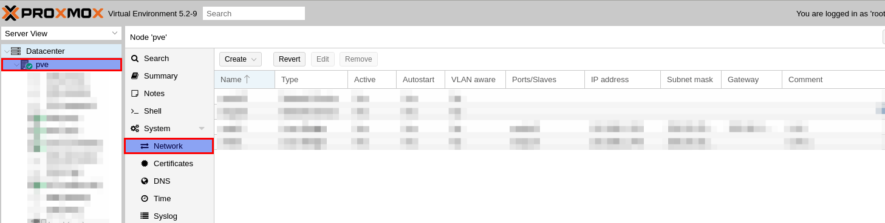
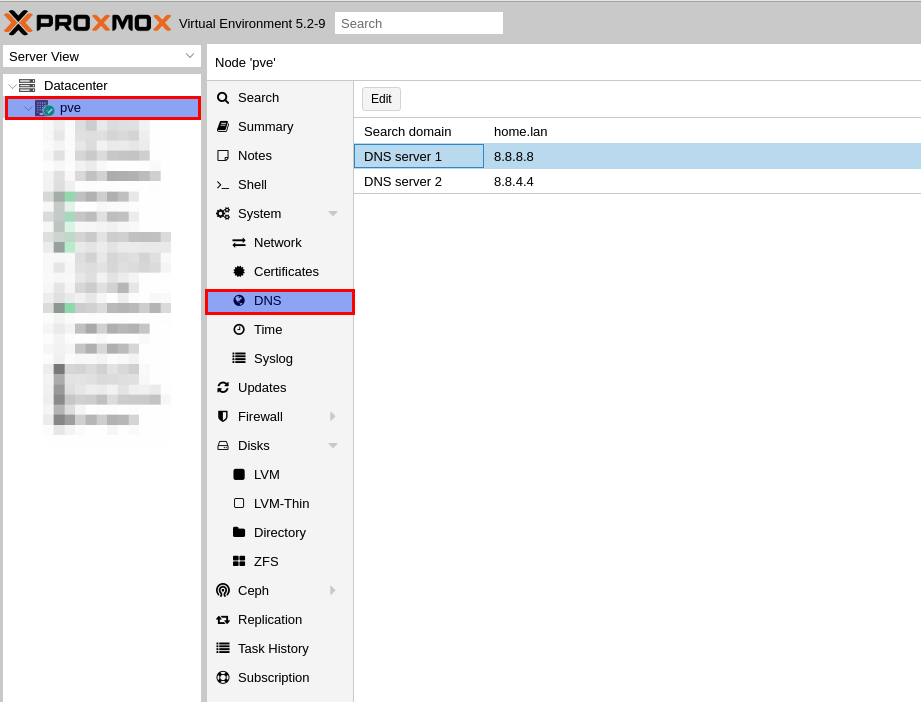

# Sommaire

<!-- TOC depthFrom:1 depthTo:6 withLinks:1 updateOnSave:1 orderedList:0 -->

- [Sommaire](#sommaire)
	- [Découverte](#dcouverte)
	- [Caractéristiques de Proxmox VE](#caractristiques-de-proxmox-ve)
	- [Lab.](#lab)
		- [Hardware](#hardware)
		- [Installlation](#installlation)
		- [Configurations](#configurations)
			- [Network configurations](#network-configurations)
			- [DNS](#dns)

<!-- /TOC -->

## Découverte

 Proxmox Virtual Environment est une solution de virtualisation libre (licence AGPLv3) basée sur l'hyperviseur Linux KVM, et offre aussi une solution de containers avec LXC.

 Elle propose un support payant.

 Proxmox est une solution de virtualisation de type "bare metal".

 Le packaging de Proxmox VE est fourni sur une image iso.

 L'installateur (basé sur Debian) configure tout ceci :

 - Système d'exploitation complet (Debian Stable 64 bits)
 - Partitionnement de disque dur avec LVM2 et ZFS
 - Support de LXC (containers) et du module KVM (virtualisation complète)
 - Outils de sauvegarde et de restauration
 - Interface web d'administration et de supervision.
 - Fonctions de clustering qui permet par exemple la migration à chaud des machines virtuelles d'un serveur physique à un autre (à condition d'utiliser un stockage partagé, SAN, ou Ceph sinon la migration entraîne une courte interruption lors du redémarrage sur un autre nœud du cluster).

## Caractéristiques de Proxmox VE

Propose 2 types de virtualisation :
- virtualisation matérielle (ou complète) : KVM : permet la virtualisation de tout système d'exploitation sur des processeurs d'architectures x86_64 disposant des technologies Intel VT ou AMD-V.

- virtualisation par container : LXC : permet la création d'instances de système d'exploitation isolées, Linux uniquement, appelées Serveurs Privés Virtuels (VPS), environnements virtuels (VE) ou Containers. Cette solution est plus performante (consomme moins de ressources) qu'une virtualisation matérielle du fait du peu d'overhead.
- gratuit (mais support payant)

## Lab.

Proxmox permet de se monter un Labo à domicile à moindre frais !

> A adapter selon votre FAI

Pour exemple :
- Hostname : PVE
- IP : 192.168.1.250
- Subnet Mask : 255.255.255.0
- Gateway : 192.168.1.254
- Partition type : ZFS (RAID0)
- DNS : 8.8.8.8, 8.8.4.4

### Hardware

- CPU : x86_64 disposant des technologies Intel VT ou AMD-V
- RAM : 8GB (ou +)
- Disk : 500 GB (RAID0 - pour de meilleurs performances)
- LAN : Une carte Ethernet Gigabit (ou +)

### Installlation

Récuperez le media d'installation et le guide :

- [Proxmox VE ISO Installer](https://www.proxmox.com/en/downloads/)
- [Proxmox VE Admin Guide ](https://www.proxmox.com/en/downloads/item/proxmox-ve-admin-guide-for-5-x)

### Configurations

#### Network configurations

A l'aide de l'interface web :

Selectionnez :
- Noeud (PVE)
	- Network

L'assistant d'installation à crée automatiquement :

- Names : vmbr0
- Type : Linux Bridge
- Ports : enp2s0
- IP : 192.168.x.250
- Subnet mask : 255.255.255.0
- Gateway : 192.168.x.x
- Comment : LAN1

> A noter qu'un bridge peux agréger plusieurs cartes ethernet

#### DNS

A l'aide de l'interface web :

Selectionnez :
- Noeud (PVE)
	- Network
		- DNS

> Pour le moment nous utiliserons les DNS de Google, cette configuration évoluera lors que nous deployerons notre DNS local.

- DNS Server 1 : 8.8.8.8
- DNS Server 2 : 8.8.4.4
